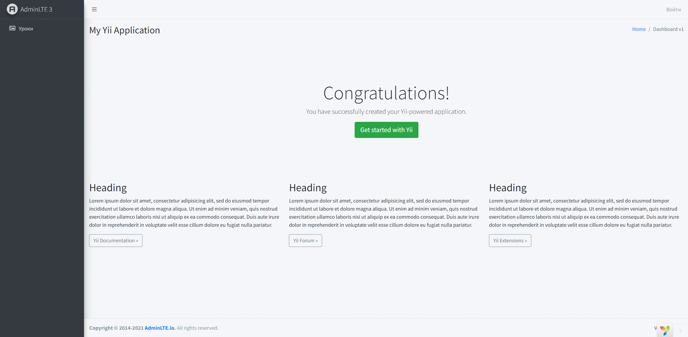
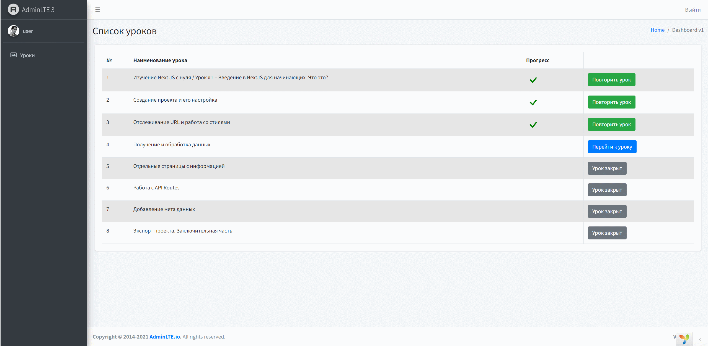
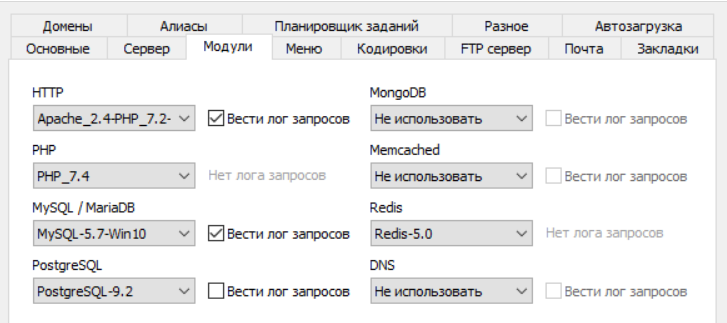

## Запуск проекта
1) Скопируйте проект
<pre>
    git clone https://github.com/ilyaBob/curse.git
</pre>
2) В корневом каталоге введите:
<pre>
    composer install
</pre>
3) Настройте базу данных.
4) Файл с готовой базой находится в [materials](materials)
5) Данные для входа  
   ========================== 
   Логин: admin 
   Пароль: admin 
   ========================== 
   Логин: user 
   Пароль: user  

5) Вход в аккаунт
   
6) Просмотр урока
   
7) Настройки сервера 
   
